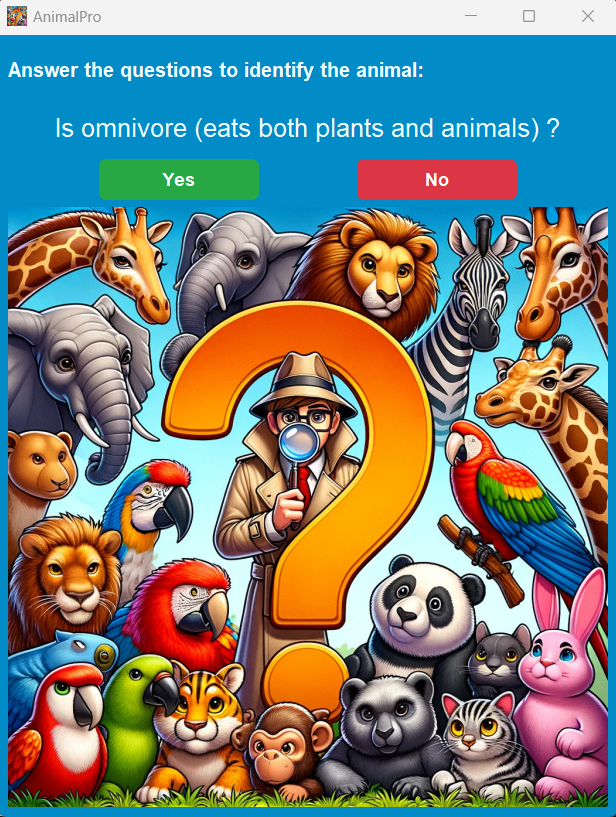
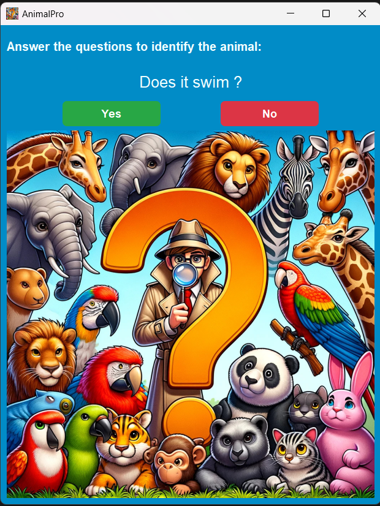
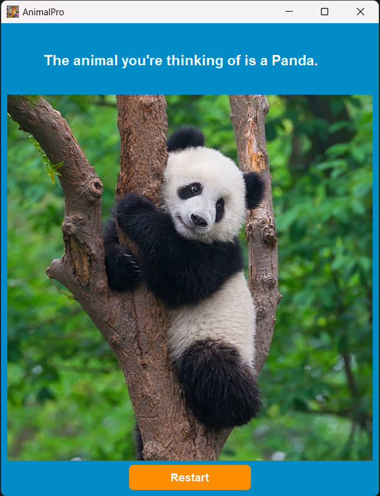
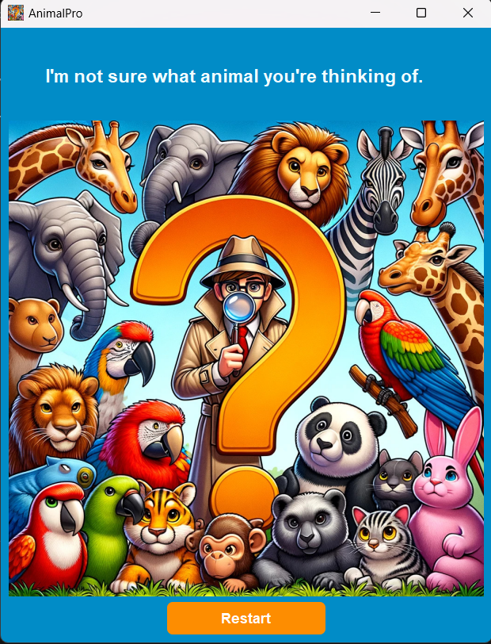

# AnimalPro

Welcome to AnimalPro, your expert guide in the world of zoology! AnimalPro is an application designed to assist users in identifying various species of animals quickly and accurately. Powered by Prolog's logical programming capabilities and PyQt's graphical interface.

<p align="center">


## Overview:

AnimalPro uses a knowledge base of facts and rules in Prolog to facilitate the identification of animals. Users interact with the AnimalPro through PyQt GUI, where they can answer yes or no to questions about the characteristics of an animal, such as its habitat, physical features, sound, diet, and behavior. Behind the scenes, AnimalPro leverages Prolog's inference engine to deduce the most likely matches based on the provided criteria.

## Key Features:

1. **Categories and Characteristics Mapping**:
    
    AnimalPro maps animal characteristics to specific categories, helping in organizing data, which simplifies the rule-checking process.
    
2. **Animal Definitions:**
    
    AnimalPro defines an extensive list of animals along with their characteristics. Each animal is represented as a term with two arguments: the name of the animal and a list of characteristics.
    
3. **Rule-Based Inference**:
    1.  Characteristics of animals are represented as rules.
    2.  Check each rule against the characteristics of animals in the knowledge base, by recursively traversing the list of animals and evaluating each rule against the characteristics of each animal.
4. **Interactive Querying**:
    
    AnimalPro interacts with the user by asking questions about the characteristics of the animal they are interested in, then updates the known facts based on the user's answers.
    

5. **Graphical User Interface:**
    
    AnimalPro boasts an intuitive graphical user interface (GUI) that enhances user interaction and experience. The GUI streamlines the querying process, allowing users to provide answers about an animal's characteristics with ease.
    
<table align="center">
  <tr>
    <td></td>
    <td></td>
  </tr>
  <tr>
    <td colspan="2" align="center"></td>
  </tr>
</table>

## Code Snippets:

1. **Mapping Characteristics to Categories**:
    
    ```prolog
    mapToCategory("barks", sound).
    mapToCategory("says meow", sound).
    mapToCategory("grunts", sound).
    mapToCategory("screeches", sound).
    mapToCategory("is silent", sound).
    mapToCategory("chirps", sound).
    mapToCategory("clucks", sound).
    .....
    mapToCategory("is omnivore (eats both plants and animals)", diet).
    mapToCategory("is carnivore (Meat-Eater)", diet).
    mapToCategory("is herbivore (Plant-Eater)", diet).
    .....
    mapToCategory("has fur", coating).
    mapToCategory("has feathers", coating).
    mapToCategory("has scales", coating).
    mapToCategory("has skin", coating).
    .....
    ```
    
2. **Defining Animal Characteristics**:
    
    ```prolog
    animal(dinosaur, [is_true("is omnivore (eats both plants and animals)"), is_true("is huge"), is_true("does it run"), is_true("has scales"), is_true("is wild"), is_true("roars")]),
    animal(ostrich, [is_true("is omnivore (eats both plants and animals)"), is_true("is large"), is_true("does it run"), is_true("has feathers"), is_true("is wild"), is_true("booms")]),
    animal(dog, [is_true("is omnivore (eats both plants and animals)"), is_true("is regular-sized"), is_true("does it run"), is_true("has fur"), is_true("is domestic"), is_true("barks")]),
    animal(monkey, [is_true("is omnivore (eats both plants and animals)"), is_true("is regular-sized"), is_true("does it climb"), is_true("has fur"), is_true("is wild"), is_true("chatters")]),
    animal('flying fish', [is_true("is omnivore (eats both plants and animals)"), is_true("is small"), is_true("does it fly & swim"), is_true("has scales"), is_true("is wild"), is_true("is silent")]),
    animal(penguin, [is_true("is omnivore (eats both plants and animals)"), is_true("is small"), is_true("does it swim & run"), is_true("has fur"), is_true("is domestic"), is_true("squawks")]),
    animal(chicken, [is_true("is omnivore (eats both plants and animals)"), is_true("is small"), is_true("does it run"), is_true("has feathers"), is_true("is domestic"), is_true("clucks")]),
    animal(bat, [is_true("is omnivore (eats both plants and animals)"), is_true("is small"), is_true("does it fly"), is_true("has fur"), is_true("is wild"), is_true("screeches")]),
    animal(turtle, [is_true("is omnivore (eats both plants and animals)"), is_true("is small"), is_true("does it swim"), is_true("has skin"), is_true("is wild"), is_true("clacks")]),
    animal(chameleon, [is_true("is omnivore (eats both plants and animals)"), is_true("is small"), is_true("does it crawl"), is_true("has scales"), is_true("is wild"), is_true("hisses")]),        
    animal(lizard, [is_true("is omnivore (eats both plants and animals)"), is_true("is small"), is_true("does it crawl"), is_true("has scales"), is_true("is wild"), is_true("is silent")]),
    animal(hedgehog, [is_true("is omnivore (eats both plants and animals)"), is_true("is small"), is_true("does it crawl"), is_true("has spines"), is_true("is wild"), is_true("snuffles")]),
    animal(rat, [is_true("is omnivore (eats both plants and animals)"), is_true("is tiny"), is_true("does it run"), is_true("has fur"), is_true("is domestic"), is_true("screeches")]),
    .....
    ```
    
    Each animal is associated with a list of characteristics, which are then used for matching.
    

3. **Checking Animal Rules**:
    
    ```prolog
    searchAnimals([Animal|Animals], A) --> checkAnimalRules(Animal, Animals, A).
    ```
    
    Checking animal rules. It iterates through the list of animals, checking if each animal satisfies the given characteristics or not.
    

4. **Updating Known Facts**:
    
    ```prolog
    updateState(New, Old), [Old] --> [New].
    ```
    
    Updating the state of known facts based on the answers provided during the querying process. It's used to maintain a record of what has been determined true or false.
    
5. **Checking Rule Truth**:
    
    ```prolog
    checkRule(is_true(Q), Answer, Known0, Known) :-
        if_(ruleIsKnown(Q,Answer,Known0),
            Known0 = Known,
        ( format("~s?\n", [Q]),
            read(Answer),
            (mapToCategory(Q, Category) ->
                updateCategory(Category, Q, Answer, Known0, Known)
            ;
                Known = [known(Q, Answer)|Known0]))).
    ```
    
    Check whether a given rule is known to be true or false based on the state of knowledge. If it's known, it updates the known list. Otherwise, it asks the user to give an answer  then updates the knowledge state based on that answer.
    
6. **Updating Category Information**:
    
    ```prolog
    updateCategory(Category, Q, yes, Known0, Known) :-
        findall(known(OtherQ, no), (mapToCategory(OtherQ, Category), OtherQ \= Q), OtherQs),
        append([known(Q, yes)|OtherQs], Known0, Known).
    updateCategory(_, Q, no, Known0, [known(Q, no)|Known0]).
    ```
    
    If the answer is "yes", it implies that the current characteristic is true, so all other characteristics in the same category are marked as false. If the answer is "no", only the current characteristic is marked as false.
    

## How to Run:

1. Install SWI-Prolog from the official site: [https://www.swi-prolog.org/download/stable](https://www.swi-prolog.org/download/stable)
2. Clone AnimalPro repository.
3. Jump into AnimalPro directory:

```bash
cd AnimalPro
```

4. Open the SWI-Prolog terminal:

```bash
swipl
```

5. Install the **`reif`** package:

```bash
pack_install(reif).
```

6. Go back to the previous terminal.
7. Install required Python packages:

```bash
pip install -r requirements.txt
```

8. Run the GUI:

```bash
python GUI.py
```

## Sample of Queries and Their Results:

Here you can watch some interactive queries for our program:

https://github.com/AbdElRahmanOsama182/AnimalPro/assets/52374998/18a0d041-bc7b-4049-af85-03443ef904d9


## Conclusion:

If you find a weird animal in your backyard, don't worry! You can use AnimalPro to learn more about it. Just tell us what it looks like or any special things it does, and we'll try to tell you what it might be.
